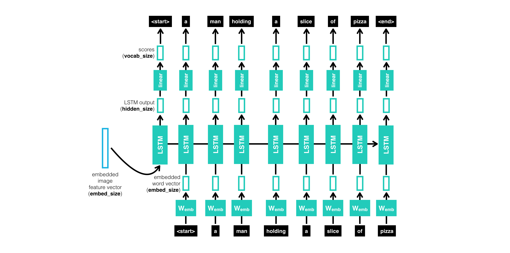

# Image-Captioning

 &#x1F449; In this project,we will study about propose a hybrid system employing the use of multilayer Convolutional Neural Network (CNN) to generate vocabulary describing the images and a Long Short Term Memory (LSTM) to accurately structure meaningful sentences using the generated keywords.
 

 &#x1F449; The convolutional neural network compares the target image to a large dataset of training images, then generates an accurate description using the trained captions.

 

## Flow of the project
#### &#x270D; Cleaning the caption data
#### &#x270D; Extracting features from images using VGG-16
#### &#x270D; Merging the captions and images
#### &#x270D; Building LSTM model for training
#### &#x270D; Predicting on test data
#### &#x270D; Evaluating the captions using BLEU scores as the metric
#### &#x270D; Explaining Encoder and Decoder
## Dataset:
[FLICKR_8K](https://forms.illinois.edu/sec/1713398).
This dataset includes around 1500 images along with 5 different captions written by different people for each image. The images are all contained together while caption text file has captions along with the image number appended to it. The zip file is approximately over 1 GB in size.

## Steps to follow:

### 1. Cleaning the captions
This is the first step of data pre-processing. The captions contain regular expressions, numbers and other stop words which need to be cleaned before they are fed to the model for further training. The cleaning part involves removing punctuations, single character and numerical values.  After cleaning we try to figure out the top 50 and least 50 words in our dataset.

 

### 2. Adding start and end sequence to the captions
Start and end sequence need to be added to the captions because the captions vary in length for each image and the model has to understand the start and the end.
 
### 3. Extracting features from images
* After dealing with the captions we then go ahead with processing the images. For this we make use of the pre-trained [Resnet-50] weights.
* Instead of using this pre-trained model for image classification as it was intended to be used. We just use it for extracting the features from the images. In order to do that we need to get rid of the last output layer from the model. The model then generates **4096** features from taking images of size (224,224,3).

Model: "model_1"
__________________________________________________________________________________________________
Layer (type)                    Output Shape         Param #     Connected to                     
==================================================================================================
input_1 (InputLayer)            (None, 224, 224, 3)  0                                            
__________________________________________________________________________________________________
conv1_pad (ZeroPadding2D)       (None, 230, 230, 3)  0           input_1[0][0]                    
__________________________________________________________________________________________________
conv1 (Conv2D)                  (None, 112, 112, 64) 9472        conv1_pad[0][0]                  
__________________________________________________________________________________________________
bn_conv1 (BatchNormalization)   (None, 112, 112, 64) 256         conv1[0][0]                      
__________________________________________________________________________________________________
activation_1 (Activation)       (None, 112, 112, 64) 0           bn_conv1[0][0]                   
__________________________________________________________________________________________________
pool1_pad (ZeroPadding2D)       (None, 114, 114, 64) 0           activation_1[0][0]               
__________________________________________________________________________________________________
max_pooling2d_1 (MaxPooling2D)  (None, 56, 56, 64)   0           pool1_pad[0][0]                  
__________________________________________________________________________________________________
res2a_branch2a (Conv2D)         (None, 56, 56, 64)   4160        max_pooling2d_1[0][0]            
__________________________________________________________________________________________________
bn2a_branch2a (BatchNormalizati (None, 56, 56, 64)   256         res2a_branch2a[0][0]             
__________________________________________________________________________________________________
activation_2 (Activation)       (None, 56, 56, 64)   0           bn2a_branch2a[0][0]              
__________________________________________________________________________________________________
res2a_branch2b (Conv2D)         (None, 56, 56, 64)   36928       activation_2[0][0]               
__________________________________________________________________________________________________
bn2a_branch2b (BatchNormalizati (None, 56, 56, 64)   256         res2a_branch2b[0][0]             
__________________________________________________________________________________________________
activation_3 (Activation)       (None, 56, 56, 64)   0           bn2a_branch2b[0][0]              
__________________________________________________________________________________________________
res2a_branch2c (Conv2D)         (None, 56, 56, 256)  16640       activation_3[0][0]               
__________________________________________________________________________________________________
res2a_branch1 (Conv2D)          (None, 56, 56, 256)  16640       max_pooling2d_1[0][0]            
__________________________________________________________________________________________________
bn2a_branch2c (BatchNormalizati (None, 56, 56, 256)  1024        res2a_branch2c[0][0]             
__________________________________________________________________________________________________
bn2a_branch1 (BatchNormalizatio (None, 56, 56, 256)  1024        res2a_branch1[0][0]              
__________________________________________________________________________________________________
add_1 (Add)                     (None, 56, 56, 256)  0           bn2a_branch2c[0][0]              
                                                                 bn2a_branch1[0][0]               
__________________________________________________________________________________________________
activation_4 (Activation)       (None, 56, 56, 256)  0           add_1[0][0]                      
__________________________________________________________________________________________________
res2b_branch2a (Conv2D)         (None, 56, 56, 64)   16448       activation_4[0][0]               
__________________________________________________________________________________________________
bn2b_branch2a (BatchNormalizati (None, 56, 56, 64)   256         res2b_branch2a[0][0]             
__________________________________________________________________________________________________
activation_5 (Activation)       (None, 56, 56, 64)   0           bn2b_branch2a[0][0]              
__________________________________________________________________________________________________
res2b_branch2b (Conv2D)         (None, 56, 56, 64)   36928       activation_5[0][0]               
__________________________________________________________________________________________________
bn2b_branch2b (BatchNormalizati (None, 56, 56, 64)   256         res2b_branch2b[0][0]             
__________________________________________________________________________________________________
activation_6 (Activation)       (None, 56, 56, 64)   0           bn2b_branch2b[0][0]              
__________________________________________________________________________________________________
res2b_branch2c (Conv2D)         (None, 56, 56, 256)  16640       activation_6[0][0]               
__________________________________________________________________________________________________
bn2b_branch2c (BatchNormalizati (None, 56, 56, 256)  1024        res2b_branch2c[0][0]             
__________________________________________________________________________________________________
add_2 (Add)                     (None, 56, 56, 256)  0           bn2b_branch2c[0][0]              
                                                                 activation_4[0][0]               
__________________________________________________________________________________________________
activation_7 (Activation)       (None, 56, 56, 256)  0           add_2[0][0]                      
__________________________________________________________________________________________________
res2c_branch2a (Conv2D)         (None, 56, 56, 64)   16448       activation_7[0][0]               
__________________________________________________________________________________________________
bn2c_branch2a (BatchNormalizati (None, 56, 56, 64)   256         res2c_branch2a[0][0]             
__________________________________________________________________________________________________
activation_8 (Activation)       (None, 56, 56, 64)   0           bn2c_branch2a[0][0]              
__________________________________________________________________________________________________
res2c_branch2b (Conv2D)         (None, 56, 56, 64)   36928       activation_8[0][0]               
__________________________________________________________________________________________________
bn2c_branch2b (BatchNormalizati (None, 56, 56, 64)   256         res2c_branch2b[0][0]             
__________________________________________________________________________________________________
activation_9 (Activation)       (None, 56, 56, 64)   0           bn2c_branch2b[0][0]              
__________________________________________________________________________________________________
res2c_branch2c (Conv2D)         (None, 56, 56, 256)  16640       activation_9[0][0]               
__________________________________________________________________________________________________
bn2c_branch2c (BatchNormalizati (None, 56, 56, 256)  1024        res2c_branch2c[0][0]             
__________________________________________________________________________________________________
add_3 (Add)                     (None, 56, 56, 256)  0           bn2c_branch2c[0][0]              
                                                                 activation_7[0][0]               
__________________________________________________________________________________________________
activation_10 (Activation)      (None, 56, 56, 256)  0           add_3[0][0]                      
__________________________________________________________________________________________________
res3a_branch2a (Conv2D)         (None, 28, 28, 128)  32896       activation_10[0][0]              
__________________________________________________________________________________________________
bn3a_branch2a (BatchNormalizati (None, 28, 28, 128)  512         res3a_branch2a[0][0]             
__________________________________________________________________________________________________
activation_11 (Activation)      (None, 28, 28, 128)  0           bn3a_branch2a[0][0]              
__________________________________________________________________________________________________
res3a_branch2b (Conv2D)         (None, 28, 28, 128)  147584      activation_11[0][0]              
__________________________________________________________________________________________________
bn3a_branch2b (BatchNormalizati (None, 28, 28, 128)  512         res3a_branch2b[0][0]             
__________________________________________________________________________________________________
activation_12 (Activation)      (None, 28, 28, 128)  0           bn3a_branch2b[0][0]              
__________________________________________________________________________________________________
res3a_branch2c (Conv2D)         (None, 28, 28, 512)  66048       activation_12[0][0]              
__________________________________________________________________________________________________
res3a_branch1 (Conv2D)          (None, 28, 28, 512)  131584      activation_10[0][0]              
__________________________________________________________________________________________________
bn3a_branch2c (BatchNormalizati (None, 28, 28, 512)  2048        res3a_branch2c[0][0]             
__________________________________________________________________________________________________
bn3a_branch1 (BatchNormalizatio (None, 28, 28, 512)  2048        res3a_branch1[0][0]              
__________________________________________________________________________________________________
add_4 (Add)                     (None, 28, 28, 512)  0           bn3a_branch2c[0][0]              
                                                                 bn3a_branch1[0][0]               
__________________________________________________________________________________________________
activation_13 (Activation)      (None, 28, 28, 512)  0           add_4[0][0]                      
__________________________________________________________________________________________________
res3b_branch2a (Conv2D)         (None, 28, 28, 128)  65664       activation_13[0][0]              
__________________________________________________________________________________________________
bn3b_branch2a (BatchNormalizati (None, 28, 28, 128)  512         res3b_branch2a[0][0]             
__________________________________________________________________________________________________
activation_14 (Activation)      (None, 28, 28, 128)  0           bn3b_branch2a[0][0]              
__________________________________________________________________________________________________
res3b_branch2b (Conv2D)         (None, 28, 28, 128)  147584      activation_14[0][0]              
__________________________________________________________________________________________________
bn3b_branch2b (BatchNormalizati (None, 28, 28, 128)  512         res3b_branch2b[0][0]             
__________________________________________________________________________________________________
activation_15 (Activation)      (None, 28, 28, 128)  0           bn3b_branch2b[0][0]              
__________________________________________________________________________________________________
res3b_branch2c (Conv2D)         (None, 28, 28, 512)  66048       activation_15[0][0]              
__________________________________________________________________________________________________
bn3b_branch2c (BatchNormalizati (None, 28, 28, 512)  2048        res3b_branch2c[0][0]             
__________________________________________________________________________________________________
add_5 (Add)                     (None, 28, 28, 512)  0           bn3b_branch2c[0][0]              
                                                                 activation_13[0][0]              
__________________________________________________________________________________________________
activation_16 (Activation)      (None, 28, 28, 512)  0           add_5[0][0]                      
__________________________________________________________________________________________________
res3c_branch2a (Conv2D)         (None, 28, 28, 128)  65664       activation_16[0][0]              
__________________________________________________________________________________________________
bn3c_branch2a (BatchNormalizati (None, 28, 28, 128)  512         res3c_branch2a[0][0]             
__________________________________________________________________________________________________
activation_17 (Activation)      (None, 28, 28, 128)  0           bn3c_branch2a[0][0]              
__________________________________________________________________________________________________
res3c_branch2b (Conv2D)         (None, 28, 28, 128)  147584      activation_17[0][0]              
__________________________________________________________________________________________________
bn3c_branch2b (BatchNormalizati (None, 28, 28, 128)  512         res3c_branch2b[0][0]             
__________________________________________________________________________________________________
activation_18 (Activation)      (None, 28, 28, 128)  0           bn3c_branch2b[0][0]              
__________________________________________________________________________________________________
res3c_branch2c (Conv2D)         (None, 28, 28, 512)  66048       activation_18[0][0]              
__________________________________________________________________________________________________
bn3c_branch2c (BatchNormalizati (None, 28, 28, 512)  2048        res3c_branch2c[0][0]             
__________________________________________________________________________________________________
add_6 (Add)                     (None, 28, 28, 512)  0           bn3c_branch2c[0][0]              
                                                                 activation_16[0][0]              
__________________________________________________________________________________________________
activation_19 (Activation)      (None, 28, 28, 512)  0           add_6[0][0]                      
__________________________________________________________________________________________________
res3d_branch2a (Conv2D)         (None, 28, 28, 128)  65664       activation_19[0][0]              
__________________________________________________________________________________________________
bn3d_branch2a (BatchNormalizati (None, 28, 28, 128)  512         res3d_branch2a[0][0]             
__________________________________________________________________________________________________
activation_20 (Activation)      (None, 28, 28, 128)  0           bn3d_branch2a[0][0]              
__________________________________________________________________________________________________
res3d_branch2b (Conv2D)         (None, 28, 28, 128)  147584      activation_20[0][0]              
__________________________________________________________________________________________________
bn3d_branch2b (BatchNormalizati (None, 28, 28, 128)  512         res3d_branch2b[0][0]             
__________________________________________________________________________________________________
activation_21 (Activation)      (None, 28, 28, 128)  0           bn3d_branch2b[0][0]              
__________________________________________________________________________________________________
res3d_branch2c (Conv2D)         (None, 28, 28, 512)  66048       activation_21[0][0]              
__________________________________________________________________________________________________
bn3d_branch2c (BatchNormalizati (None, 28, 28, 512)  2048        res3d_branch2c[0][0]             
__________________________________________________________________________________________________
add_7 (Add)                     (None, 28, 28, 512)  0           bn3d_branch2c[0][0]              
                                                                 activation_19[0][0]              
__________________________________________________________________________________________________
activation_22 (Activation)      (None, 28, 28, 512)  0           add_7[0][0]                      
__________________________________________________________________________________________________
res4a_branch2a (Conv2D)         (None, 14, 14, 256)  131328      activation_22[0][0]              
__________________________________________________________________________________________________
bn4a_branch2a (BatchNormalizati (None, 14, 14, 256)  1024        res4a_branch2a[0][0]             
__________________________________________________________________________________________________
activation_23 (Activation)      (None, 14, 14, 256)  0           bn4a_branch2a[0][0]              
__________________________________________________________________________________________________
res4a_branch2b (Conv2D)         (None, 14, 14, 256)  590080      activation_23[0][0]              
__________________________________________________________________________________________________
bn4a_branch2b (BatchNormalizati (None, 14, 14, 256)  1024        res4a_branch2b[0][0]             
__________________________________________________________________________________________________
activation_24 (Activation)      (None, 14, 14, 256)  0           bn4a_branch2b[0][0]              
__________________________________________________________________________________________________
res4a_branch2c (Conv2D)         (None, 14, 14, 1024) 263168      activation_24[0][0]              
__________________________________________________________________________________________________
res4a_branch1 (Conv2D)          (None, 14, 14, 1024) 525312      activation_22[0][0]              
__________________________________________________________________________________________________
bn4a_branch2c (BatchNormalizati (None, 14, 14, 1024) 4096        res4a_branch2c[0][0]             
__________________________________________________________________________________________________
bn4a_branch1 (BatchNormalizatio (None, 14, 14, 1024) 4096        res4a_branch1[0][0]              
__________________________________________________________________________________________________
add_8 (Add)                     (None, 14, 14, 1024) 0           bn4a_branch2c[0][0]              
                                                                 bn4a_branch1[0][0]               
__________________________________________________________________________________________________
activation_25 (Activation)      (None, 14, 14, 1024) 0           add_8[0][0]                      
__________________________________________________________________________________________________
res4b_branch2a (Conv2D)         (None, 14, 14, 256)  262400      activation_25[0][0]              
__________________________________________________________________________________________________
bn4b_branch2a (BatchNormalizati (None, 14, 14, 256)  1024        res4b_branch2a[0][0]             
__________________________________________________________________________________________________
activation_26 (Activation)      (None, 14, 14, 256)  0           bn4b_branch2a[0][0]              
__________________________________________________________________________________________________
res4b_branch2b (Conv2D)         (None, 14, 14, 256)  590080      activation_26[0][0]              
__________________________________________________________________________________________________
bn4b_branch2b (BatchNormalizati (None, 14, 14, 256)  1024        res4b_branch2b[0][0]             
__________________________________________________________________________________________________
activation_27 (Activation)      (None, 14, 14, 256)  0           bn4b_branch2b[0][0]              
__________________________________________________________________________________________________
res4b_branch2c (Conv2D)         (None, 14, 14, 1024) 263168      activation_27[0][0]              
__________________________________________________________________________________________________
bn4b_branch2c (BatchNormalizati (None, 14, 14, 1024) 4096        res4b_branch2c[0][0]             
__________________________________________________________________________________________________
add_9 (Add)                     (None, 14, 14, 1024) 0           bn4b_branch2c[0][0]              
                                                                 activation_25[0][0]              
__________________________________________________________________________________________________
activation_28 (Activation)      (None, 14, 14, 1024) 0           add_9[0][0]                      
__________________________________________________________________________________________________
res4c_branch2a (Conv2D)         (None, 14, 14, 256)  262400      activation_28[0][0]              
__________________________________________________________________________________________________
bn4c_branch2a (BatchNormalizati (None, 14, 14, 256)  1024        res4c_branch2a[0][0]             
__________________________________________________________________________________________________
activation_29 (Activation)      (None, 14, 14, 256)  0           bn4c_branch2a[0][0]              
__________________________________________________________________________________________________
res4c_branch2b (Conv2D)         (None, 14, 14, 256)  590080      activation_29[0][0]              
__________________________________________________________________________________________________
bn4c_branch2b (BatchNormalizati (None, 14, 14, 256)  1024        res4c_branch2b[0][0]             
__________________________________________________________________________________________________
activation_30 (Activation)      (None, 14, 14, 256)  0           bn4c_branch2b[0][0]              
__________________________________________________________________________________________________
res4c_branch2c (Conv2D)         (None, 14, 14, 1024) 263168      activation_30[0][0]              
__________________________________________________________________________________________________
bn4c_branch2c (BatchNormalizati (None, 14, 14, 1024) 4096        res4c_branch2c[0][0]             
__________________________________________________________________________________________________
add_10 (Add)                    (None, 14, 14, 1024) 0           bn4c_branch2c[0][0]              
                                                                 activation_28[0][0]              
__________________________________________________________________________________________________
activation_31 (Activation)      (None, 14, 14, 1024) 0           add_10[0][0]                     
__________________________________________________________________________________________________
res4d_branch2a (Conv2D)         (None, 14, 14, 256)  262400      activation_31[0][0]              
__________________________________________________________________________________________________
bn4d_branch2a (BatchNormalizati (None, 14, 14, 256)  1024        res4d_branch2a[0][0]             
__________________________________________________________________________________________________
activation_32 (Activation)      (None, 14, 14, 256)  0           bn4d_branch2a[0][0]              
__________________________________________________________________________________________________
res4d_branch2b (Conv2D)         (None, 14, 14, 256)  590080      activation_32[0][0]              
__________________________________________________________________________________________________
bn4d_branch2b (BatchNormalizati (None, 14, 14, 256)  1024        res4d_branch2b[0][0]             
__________________________________________________________________________________________________
activation_33 (Activation)      (None, 14, 14, 256)  0           bn4d_branch2b[0][0]              
__________________________________________________________________________________________________
res4d_branch2c (Conv2D)         (None, 14, 14, 1024) 263168      activation_33[0][0]              
__________________________________________________________________________________________________
bn4d_branch2c (BatchNormalizati (None, 14, 14, 1024) 4096        res4d_branch2c[0][0]             
__________________________________________________________________________________________________
add_11 (Add)                    (None, 14, 14, 1024) 0           bn4d_branch2c[0][0]              
                                                                 activation_31[0][0]              
__________________________________________________________________________________________________
activation_34 (Activation)      (None, 14, 14, 1024) 0           add_11[0][0]                     
__________________________________________________________________________________________________
res4e_branch2a (Conv2D)         (None, 14, 14, 256)  262400      activation_34[0][0]              
__________________________________________________________________________________________________
bn4e_branch2a (BatchNormalizati (None, 14, 14, 256)  1024        res4e_branch2a[0][0]             
__________________________________________________________________________________________________
activation_35 (Activation)      (None, 14, 14, 256)  0           bn4e_branch2a[0][0]              
__________________________________________________________________________________________________
res4e_branch2b (Conv2D)         (None, 14, 14, 256)  590080      activation_35[0][0]              
__________________________________________________________________________________________________
bn4e_branch2b (BatchNormalizati (None, 14, 14, 256)  1024        res4e_branch2b[0][0]             
__________________________________________________________________________________________________
activation_36 (Activation)      (None, 14, 14, 256)  0           bn4e_branch2b[0][0]              
__________________________________________________________________________________________________
res4e_branch2c (Conv2D)         (None, 14, 14, 1024) 263168      activation_36[0][0]              
__________________________________________________________________________________________________
bn4e_branch2c (BatchNormalizati (None, 14, 14, 1024) 4096        res4e_branch2c[0][0]             
__________________________________________________________________________________________________
add_12 (Add)                    (None, 14, 14, 1024) 0           bn4e_branch2c[0][0]              
                                                                 activation_34[0][0]              
__________________________________________________________________________________________________
activation_37 (Activation)      (None, 14, 14, 1024) 0           add_12[0][0]                     
__________________________________________________________________________________________________
res4f_branch2a (Conv2D)         (None, 14, 14, 256)  262400      activation_37[0][0]              
__________________________________________________________________________________________________
bn4f_branch2a (BatchNormalizati (None, 14, 14, 256)  1024        res4f_branch2a[0][0]             
__________________________________________________________________________________________________
activation_38 (Activation)      (None, 14, 14, 256)  0           bn4f_branch2a[0][0]              
__________________________________________________________________________________________________
res4f_branch2b (Conv2D)         (None, 14, 14, 256)  590080      activation_38[0][0]              
__________________________________________________________________________________________________
bn4f_branch2b (BatchNormalizati (None, 14, 14, 256)  1024        res4f_branch2b[0][0]             
__________________________________________________________________________________________________
activation_39 (Activation)      (None, 14, 14, 256)  0           bn4f_branch2b[0][0]              
__________________________________________________________________________________________________
res4f_branch2c (Conv2D)         (None, 14, 14, 1024) 263168      activation_39[0][0]              
__________________________________________________________________________________________________
bn4f_branch2c (BatchNormalizati (None, 14, 14, 1024) 4096        res4f_branch2c[0][0]             
__________________________________________________________________________________________________
add_13 (Add)                    (None, 14, 14, 1024) 0           bn4f_branch2c[0][0]              
                                                                 activation_37[0][0]              
__________________________________________________________________________________________________
activation_40 (Activation)      (None, 14, 14, 1024) 0           add_13[0][0]                     
__________________________________________________________________________________________________
res5a_branch2a (Conv2D)         (None, 7, 7, 512)    524800      activation_40[0][0]              
__________________________________________________________________________________________________
bn5a_branch2a (BatchNormalizati (None, 7, 7, 512)    2048        res5a_branch2a[0][0]             
__________________________________________________________________________________________________
activation_41 (Activation)      (None, 7, 7, 512)    0           bn5a_branch2a[0][0]              
__________________________________________________________________________________________________
res5a_branch2b (Conv2D)         (None, 7, 7, 512)    2359808     activation_41[0][0]              
__________________________________________________________________________________________________
bn5a_branch2b (BatchNormalizati (None, 7, 7, 512)    2048        res5a_branch2b[0][0]             
__________________________________________________________________________________________________
activation_42 (Activation)      (None, 7, 7, 512)    0           bn5a_branch2b[0][0]              
__________________________________________________________________________________________________
res5a_branch2c (Conv2D)         (None, 7, 7, 2048)   1050624     activation_42[0][0]              
__________________________________________________________________________________________________
res5a_branch1 (Conv2D)          (None, 7, 7, 2048)   2099200     activation_40[0][0]              
__________________________________________________________________________________________________
bn5a_branch2c (BatchNormalizati (None, 7, 7, 2048)   8192        res5a_branch2c[0][0]             
__________________________________________________________________________________________________
bn5a_branch1 (BatchNormalizatio (None, 7, 7, 2048)   8192        res5a_branch1[0][0]              
__________________________________________________________________________________________________
add_14 (Add)                    (None, 7, 7, 2048)   0           bn5a_branch2c[0][0]              
                                                                 bn5a_branch1[0][0]               
__________________________________________________________________________________________________
activation_43 (Activation)      (None, 7, 7, 2048)   0           add_14[0][0]                     
__________________________________________________________________________________________________
res5b_branch2a (Conv2D)         (None, 7, 7, 512)    1049088     activation_43[0][0]              
__________________________________________________________________________________________________
bn5b_branch2a (BatchNormalizati (None, 7, 7, 512)    2048        res5b_branch2a[0][0]             
__________________________________________________________________________________________________
activation_44 (Activation)      (None, 7, 7, 512)    0           bn5b_branch2a[0][0]              
__________________________________________________________________________________________________
res5b_branch2b (Conv2D)         (None, 7, 7, 512)    2359808     activation_44[0][0]              
__________________________________________________________________________________________________
bn5b_branch2b (BatchNormalizati (None, 7, 7, 512)    2048        res5b_branch2b[0][0]             
__________________________________________________________________________________________________
activation_45 (Activation)      (None, 7, 7, 512)    0           bn5b_branch2b[0][0]              
__________________________________________________________________________________________________
res5b_branch2c (Conv2D)         (None, 7, 7, 2048)   1050624     activation_45[0][0]              
__________________________________________________________________________________________________
bn5b_branch2c (BatchNormalizati (None, 7, 7, 2048)   8192        res5b_branch2c[0][0]             
__________________________________________________________________________________________________
add_15 (Add)                    (None, 7, 7, 2048)   0           bn5b_branch2c[0][0]              
                                                                 activation_43[0][0]              
__________________________________________________________________________________________________
activation_46 (Activation)      (None, 7, 7, 2048)   0           add_15[0][0]                     
__________________________________________________________________________________________________
res5c_branch2a (Conv2D)         (None, 7, 7, 512)    1049088     activation_46[0][0]              
__________________________________________________________________________________________________
bn5c_branch2a (BatchNormalizati (None, 7, 7, 512)    2048        res5c_branch2a[0][0]             
__________________________________________________________________________________________________
activation_47 (Activation)      (None, 7, 7, 512)    0           bn5c_branch2a[0][0]              
__________________________________________________________________________________________________
res5c_branch2b (Conv2D)         (None, 7, 7, 512)    2359808     activation_47[0][0]              
__________________________________________________________________________________________________
bn5c_branch2b (BatchNormalizati (None, 7, 7, 512)    2048        res5c_branch2b[0][0]             
__________________________________________________________________________________________________
activation_48 (Activation)      (None, 7, 7, 512)    0           bn5c_branch2b[0][0]              
__________________________________________________________________________________________________
res5c_branch2c (Conv2D)         (None, 7, 7, 2048)   1050624     activation_48[0][0]              
__________________________________________________________________________________________________
bn5c_branch2c (BatchNormalizati (None, 7, 7, 2048)   8192        res5c_branch2c[0][0]             
__________________________________________________________________________________________________
add_16 (Add)                    (None, 7, 7, 2048)   0           bn5c_branch2c[0][0]              
                                                                 activation_46[0][0]              
__________________________________________________________________________________________________
activation_49 (Activation)      (None, 7, 7, 2048)   0           add_16[0][0]                     
__________________________________________________________________________________________________
avg_pool (GlobalAveragePooling2 (None, 2048)         0           activation_49[0][0]              
==================================================================================================
Total params: 23,587,712
Trainable params: 23,534,592
Non-trainable params: 53,120
 

### 4. Viewing similar images
When the Resnet-50 model finishes extracting features from all the images from the dataset, similar images from the clusters are displayed together to see if the VGG16 model has extracted the features correctly and we are able to see them together.

 

### 5. Merging the caption with the respective images
* The next step involves merging the captions with the respective images so that they can be used for training. Here we are only taking the first caption of each image from the dataset as it becomes complicated to train with all 5 of them. 
* Then we have to tokenize all the captions before feeding it to the model.

### 6. Splitting the data for training and testing
The tokenized captions along with the image data are split into training, test and validation sets as required and are then pre-processed as required for the input for the model.

### 7. Building the LSTM model

 
LSTM model is been used beacuse it takes into consideration the state of the previous cell's output and the present cell's input for the current output. This is useful while generating the captions for the images. 
The step involves building the LSTM model with two or three input layers and one output layer where the captions are generated. The model can be trained with various number of nodes and layers. We start with 256 and try out with 512 and 1024. Various hyperparameters are used to tune the model to generate acceptable captions

## LSTM Model Summary:
Model: "model_2"
__________________________________________________________________________________________________
Layer (type)                    Output Shape         Param #     Connected to                     
==================================================================================================
embedding_1_input (InputLayer)  (None, 37)           0                                            
__________________________________________________________________________________________________
dense_1_input (InputLayer)      (None, 2048)         0                                            
__________________________________________________________________________________________________
embedding_1 (Embedding)         (None, 37, 128)      510592      embedding_1_input[0][0]          
__________________________________________________________________________________________________
dense_1 (Dense)                 (None, 128)          262272      dense_1_input[0][0]              
__________________________________________________________________________________________________
lstm_1 (LSTM)                   (None, 37, 256)      394240      embedding_1[0][0]                
__________________________________________________________________________________________________
repeat_vector_1 (RepeatVector)  (None, 37, 128)      0           dense_1[0][0]                    
__________________________________________________________________________________________________
time_distributed_1 (TimeDistrib (None, 37, 128)      32896       lstm_1[0][0]                     
__________________________________________________________________________________________________
concatenate_1 (Concatenate)     (None, 37, 256)      0           repeat_vector_1[0][0]            
                                                                 time_distributed_1[0][0]         
__________________________________________________________________________________________________
lstm_2 (LSTM)                   (None, 37, 128)      197120      concatenate_1[0][0]              
__________________________________________________________________________________________________
lstm_3 (LSTM)                   (None, 512)          1312768     lstm_2[0][0]                     
__________________________________________________________________________________________________
dense_3 (Dense)                 (None, 3989)         2046357     lstm_3[0][0]                     
__________________________________________________________________________________________________
activation_50 (Activation)      (None, 3989)         0           dense_3[0][0]                    
==================================================================================================
Total params: 4,756,245
Trainable params: 4,756,245
Non-trainable params: 0
 
 

## Image Model Summary:
Model: "sequential_1"
_________________________________________________________________
Layer (type)                 Output Shape              Param #   
=================================================================
dense_1 (Dense)              (None, 128)               262272    
_________________________________________________________________
repeat_vector_1 (RepeatVecto (None, 37, 128)           0         
=================================================================
Total params: 262,272
Trainable params: 262,272
Non-trainable params: 0
_________________________________________________________________

## Language Model Summary:
Model: "sequential_2"
_________________________________________________________________
Layer (type)                 Output Shape              Param #   
=================================================================
embedding_1 (Embedding)      (None, 37, 128)           510592    
_________________________________________________________________
lstm_1 (LSTM)                (None, 37, 256)           394240    
_________________________________________________________________
time_distributed_1 (TimeDist (None, 37, 128)           32896     
=================================================================
Total params: 937,728
Trainable params: 937,728
Non-trainable params: 0
_________________________________________________________________
 

### 8. Predicting on the test dataset and evaluating using BLEU scores
After the model is trained, it is tested on test dataset to see how it performs on caption generation for just 5 images. If the captions are acceptable then captions are generated for the whole test data. 

### Good Predictions

### Bad Predictions

## Explaining Encoder and Decoder
  ## Encoder: 
  
  For Encoder we use ResNet-50. ResNet-50 is a convolutional neural network that is trained on more than a million images from the ImageNet database. The network is 50 layers deep and can classify images into 1000 object categories, such as keyboard, mouse, pencil, and many animals. As a result, the network has learned rich feature representations for a wide range of images. The network has an image input size of 224-by-224.   

## Decode:

For Decoder we use LSTM. Long Short-Term Memory (LSTM) networks are a modified version of recurrent neural networks, which makes it easier to remember past data in memory. The vanishing gradient problem of RNN is resolved here. LSTM is well-suited to classify, process and predict time series given time lags of unknown duration. It trains the model by using back-propagation.
